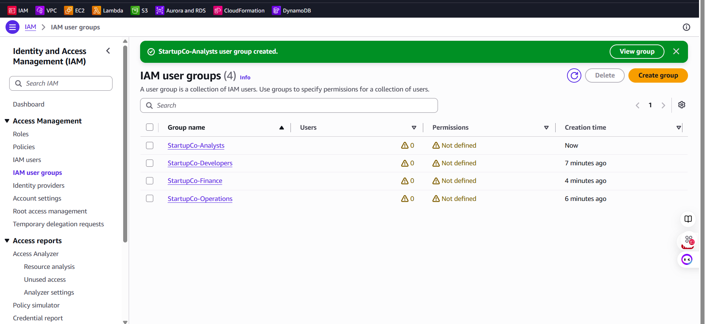
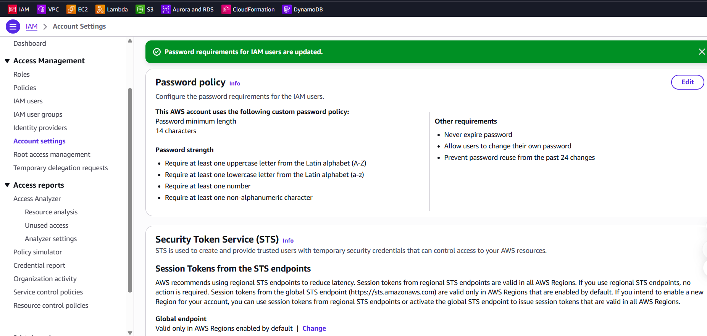

# Implementation

## Implementation Overview

This implementation replaced StartupCo's shared-root access model with role-based IAM groups, individually attributable fictional users, scoped permissions, strong password requirements, and MFA enforcement.

The solution was implemented through a combination of:

- AWS Management Console
- AWS CLI
- PowerShell
- IAM customer-managed policies
- AWS-managed policies
- IAM credential reports
- IAM Policy Simulator

## Prerequisites

- An AWS account
- An administrative IAM identity protected by MFA
- AWS CLI installed and configured
- PowerShell
- No use of root credentials for daily implementation activities

The active CLI identity was verified before changes were made:

```powershell
aws iam get-user --query "User.UserName" --output text
```

## 1. Root-Account Security

The root account was reviewed to confirm:

- MFA was enabled.
- No root access key existed.
- Root credentials were not used for implementation.
- Root access was reserved for root-only account activities.

An IAM credential report later validated the root controls.

## 2. IAM Groups

Four groups were created:

```text
StartupCo-Developers
StartupCo-Operations
StartupCo-Finance
StartupCo-Analysts
```

The groups were initially created without permissions. This secure default allowed the access requirements to be reviewed before policies were attached.



## 3. Developer Permissions

A customer-managed policy named `StartupCoDeveloperAccess` was created.

The policy allows developers to:

- View relevant EC2 resource information
- Start, stop, and reboot approved development instances
- Manage objects in StartupCo application-file buckets
- View and query CloudWatch Logs

EC2 management actions require both resource tags:

```text
Environment = Development
Project = StartupCo
```

S3 access is restricted to bucket names matching:

```text
startupco-app-*
```

Developers are not granted IAM administration, billing administration, or RDS management.

## 4. Operations Permissions

The Operations group received the AWS-managed policies:

```text
AmazonEC2FullAccess
CloudWatchFullAccessV2
AmazonSSMFullAccess
AmazonRDSFullAccess
```

These policies satisfy the lab requirement for broad infrastructure management.

The Operations role does not receive general IAM or billing administration. The broad service policies should be narrowed around actual operational tasks in a production implementation.

## 5. Finance Permissions

The Finance group received:

```text
AWSBillingReadOnlyAccess
AWSBudgetsReadOnlyAccess
ReadOnlyAccess
```

These policies allow Finance to:

- View billing and usage
- Access Cost Explorer
- View AWS Budgets
- Review AWS resource configurations

The policies do not grant general infrastructure-modification rights.

## 6. Analyst Permissions

An inline group policy named `StartupCoAnalystReadOnlyAccess` was created and embedded in the StartupCo-Analysts group.

The policy permits:

- Listing approved analytical buckets
- Reading approved analytical objects
- Viewing RDS instances, clusters, snapshots, subnet groups, events, and tags

S3 access is limited to:

```text
startupco-analytics-*
```

The policy does not permit:

- Uploading objects
- Modifying objects
- Deleting objects
- Administering RDS
- Querying database tables without separate database credentials and privileges

## 7. Password Policy

The IAM account password policy was configured with:

```text
Minimum length: 14 characters
Uppercase required: Yes
Lowercase required: Yes
Number required: Yes
Symbol required: Yes
Users may change their own password: Yes
Password reuse prevention: 24 passwords
Scheduled password expiration: Disabled
```



## 8. MFA Enforcement

A customer-managed policy named `StartupCoRequireMFA` was attached to all four groups.

The policy allows unauthenticated-MFA sessions to perform only the actions needed to:

- View password requirements
- Change the user's own password
- Create a virtual MFA device
- Enable the user's own MFA device
- View or resynchronize the user's own MFA device

All other actions are explicitly denied when:

```text
aws:MultiFactorAuthPresent = false
```

Because an explicit deny overrides an allow, this control also applies to Operations users with broad infrastructure policies.

## 9. User Creation and Assignment

Ten users were created through PowerShell and the AWS CLI:

| Group | Users |
|---|---:|
| StartupCo-Developers | 4 |
| StartupCo-Operations | 2 |
| StartupCo-Finance | 1 |
| StartupCo-Analysts | 3 |

Each user received:

```text
Project = StartupCo
Team = <assigned team>
```

The automation used the following pattern:

```powershell
aws iam create-user `
    --user-name $assignment.UserName `
    --tags `
        "Key=Project,Value=StartupCo" `
        "Key=Team,Value=$($assignment.Team)"

aws iam add-user-to-group `
    --user-name $assignment.UserName `
    --group-name $assignment.GroupName
```

No console passwords or access keys were created.


## 10. Credential Audit

An IAM credential report was generated:

```powershell
aws iam generate-credential-report
```

The report was decoded and filtered to the fictional StartupCo users.

Every StartupCo user showed:

```text
password_enabled      = false
mfa_active            = false
access_key_1_active   = false
access_key_2_active   = false
```

The users are therefore dormant identities rather than active credentials. The MFA enforcement policy applies when an identity is activated for authentication.


## 11. Permission Validation

The IAM Policy Simulator was called through the AWS CLI using each test user's principal ARN.

MFA context was supplied using:

```text
ContextKeyName=aws:MultiFactorAuthPresent
ContextKeyValues=true or false
ContextKeyType=boolean
```

The tests covered:

- Access attempted without MFA
- Authorized actions with MFA
- Unauthorized actions with MFA
- Read versus write access
- Infrastructure access versus IAM administration


## 12. Root Credential Audit

The credential report confirmed:

```text
mfa_active            = true
access_key_1_active   = false
access_key_2_active   = false
```


## Final Implemented State

The completed group structure contained:

| IAM group | Members | Permissions |
|---|---:|---|
| StartupCo-Developers | 4 | Defined |
| StartupCo-Operations | 2 | Defined |
| StartupCo-Finance | 1 | Defined |
| StartupCo-Analysts | 3 | Defined |

The shared-root access model was replaced with:

```text
Individual identities
        ↓
Role-based groups
        ↓
MFA enforcement
        ↓
Team-specific permissions
        ↓
Allowed and denied behavior validation
```

## Implementation Limitations

This implementation does not include:

- Permanent authentication credentials for fictional users
- A deployed fitness-tracking application
- A live analytical S3 bucket
- A live RDS database
- Database-level SQL roles
- IAM Identity Center deployment
- Multi-account environment separation
- Infrastructure as code

These items are documented as future enhancements rather than represented as completed work.