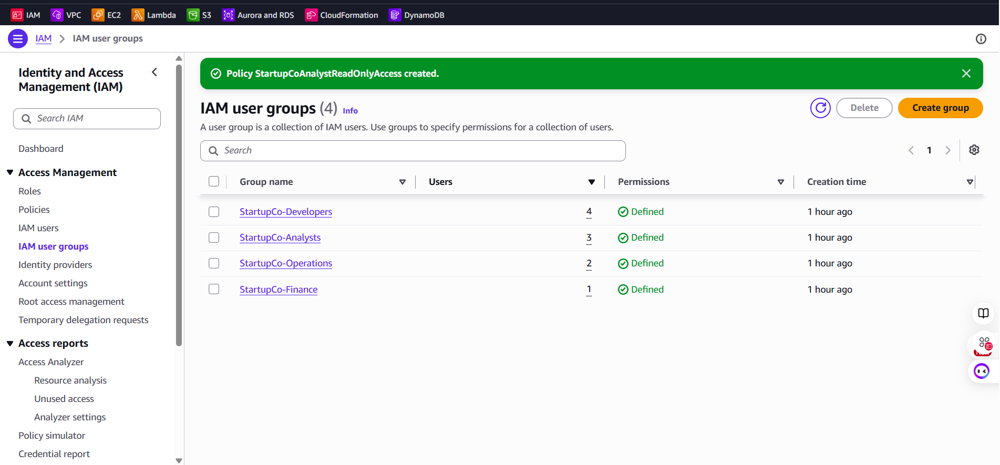
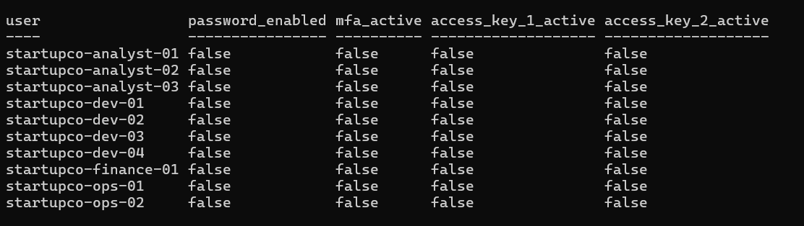
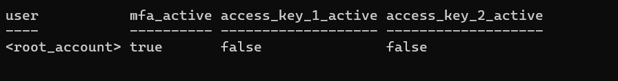
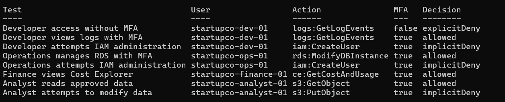

# Validation

## Validation Objective

The solution was tested to determine whether:

1. Root-account security controls were active.
2. Fictional employees had no unnecessary credentials.
3. Group membership matched StartupCo's team structure.
4. MFA was required before resource access.
5. Authorized team actions were allowed.
6. Unauthorized actions were denied.
7. Read-only access prevented data modification.

## Validation Summary

| Control | Expected result | Actual result | Status |
|---|---|---|---|
| Root MFA | Active | `true` | Pass |
| Root access key 1 | Inactive | `false` | Pass |
| Root access key 2 | Inactive | `false` | Pass |
| Developer membership | 4 users | 4 users | Pass |
| Operations membership | 2 users | 2 users | Pass |
| Finance membership | 1 user | 1 user | Pass |
| Analyst membership | 3 users | 3 users | Pass |
| Fictional console passwords | None | None | Pass |
| Fictional access keys | None | None | Pass |
| Resource access without MFA | Explicitly denied | `explicitDeny` | Pass |
| Authorized access with MFA | Allowed | `allowed` | Pass |
| Unauthorized IAM administration | Denied | `implicitDeny` | Pass |
| Analyst write access | Denied | `implicitDeny` | Pass |

## Test 1: IAM Group Structure

### Purpose

Verify that all four role-based groups exist, contain the required number of users, and have defined permissions.

### Result

| IAM group | Expected users | Actual users | Permissions |
|---|---:|---:|---|
| StartupCo-Developers | 4 | 4 | Defined |
| StartupCo-Operations | 2 | 2 | Defined |
| StartupCo-Finance | 1 | 1 | Defined |
| StartupCo-Analysts | 3 | 3 | Defined |

### Status

**Pass**



## Test 2: Fictional User Credential Audit

### Purpose

Confirm that portfolio identities do not introduce unnecessary passwords or access keys.

### Method

An IAM credential report was generated, decoded, and filtered to usernames matching:

```text
startupco-*
```

### Result

All ten users returned:

```text
password_enabled      = false
mfa_active            = false
access_key_1_active   = false
access_key_2_active   = false
```

`mfa_active=false` is expected because the dormant users have no authentication credentials. If console access is activated, the group-level MFA enforcement policy restricts the user to MFA-enrollment actions until MFA is present.

### Status

**Pass**



## Test 3: Root Security

### Purpose

Confirm that the root user is protected and has no programmatic credentials.

### Result

```text
mfa_active            = true
access_key_1_active   = false
access_key_2_active   = false
```

### Status

**Pass**



## Test 4: Developer Access Without MFA

### Principal

```text
startupco-dev-01
```

### Simulated action

```text
logs:GetLogEvents
```

### MFA context

```text
false
```

### Expected result

The MFA enforcement policy should explicitly deny the action even though the Developer policy allows CloudWatch Logs access.

### Actual result

```text
explicitDeny
```

### Status

**Pass**

This demonstrates that an explicit deny overrides permissions granted by another policy.

## Test 5: Developer Access With MFA

### Principal

```text
startupco-dev-01
```

### Simulated action

```text
logs:GetLogEvents
```

### MFA context

```text
true
```

### Expected result

```text
allowed
```

### Actual result

```text
allowed
```

### Status

**Pass**

## Test 6: Developer IAM Administration

### Principal

```text
startupco-dev-01
```

### Simulated action

```text
iam:CreateUser
```

### MFA context

```text
true
```

### Expected result

The developer should remain unable to create IAM users after satisfying MFA.

### Actual result

```text
implicitDeny
```

### Status

**Pass**

MFA satisfies an authentication requirement; it does not elevate the user's job-based permissions.

## Test 7: Operations RDS Management

### Principal

```text
startupco-ops-01
```

### Simulated action

```text
rds:ModifyDBInstance
```

### MFA context

```text
true
```

### Expected result

```text
allowed
```

### Actual result

```text
allowed
```

### Status

**Pass**

## Test 8: Operations IAM Administration

### Principal

```text
startupco-ops-01
```

### Simulated action

```text
iam:CreateUser
```

### MFA context

```text
true
```

### Expected result

Operations infrastructure access should not provide IAM administration.

### Actual result

```text
implicitDeny
```

### Status

**Pass**

## Test 9: Finance Cost Explorer Access

### Principal

```text
startupco-finance-01
```

### Simulated action

```text
ce:GetCostAndUsage
```

### MFA context

```text
true
```

### Expected result

```text
allowed
```

### Actual result

```text
allowed
```

### Status

**Pass**

## Test 10: Analyst Read Access

### Principal

```text
startupco-analyst-01
```

### Resource

```text
arn:aws:s3:::startupco-analytics-demo/sample.csv
```

### Simulated action

```text
s3:GetObject
```

### MFA context

```text
true
```

### Expected result

```text
allowed
```

### Actual result

```text
allowed
```

### Status

**Pass**

## Test 11: Analyst Write Restriction

### Principal

```text
startupco-analyst-01
```

### Resource

```text
arn:aws:s3:::startupco-analytics-demo/sample.csv
```

### Simulated action

```text
s3:PutObject
```

### MFA context

```text
true
```

### Expected result

```text
implicitDeny
```

### Actual result

```text
implicitDeny
```

### Status

**Pass**

The analyst can read approved objects but cannot create or overwrite them.



## Understanding the Decisions

### `allowed`

At least one applicable policy permits the action, and no applicable policy explicitly denies it.

### `implicitDeny`

No applicable policy grants the requested action. AWS denies requests by default unless an allow exists.

### `explicitDeny`

An applicable policy deliberately denies the action. An explicit deny overrides an allow from another policy.

## Troubleshooting Record

### Problem

The initial simulation script returned a blank `Decision` column.

A direct simulation exposed this error:

```text
Invalid ARN provided in the request
```

The original PowerShell string was:

```powershell
"arn:aws:iam::$startupCoAccountId:user/$UserName"
```

PowerShell interpreted the colon after the variable name as part of a scoped-variable expression, resulting in a malformed ARN.

### Resolution

The account-ID variable was enclosed in braces:

```powershell
"arn:aws:iam::${startupCoAccountId}:user/$UserName"
```

The corrected script produced valid policy-simulation results.

### Lesson

When a PowerShell variable is immediately followed by a colon inside an interpolated string, braces should clearly delimit the variable name.

## Final Validation Outcome

All planned tests passed.

The validation demonstrated that:

- Root is protected with MFA.
- Root has no access keys.
- Fictional users have no unnecessary credentials.
- Team membership matches the business requirements.
- MFA is enforced before AWS resource access.
- Authorized activity is permitted.
- Unauthorized IAM administration is denied.
- Analyst write operations are denied.
- Permissions behave differently according to team responsibilities.

The solution satisfies the defined lab success criteria.