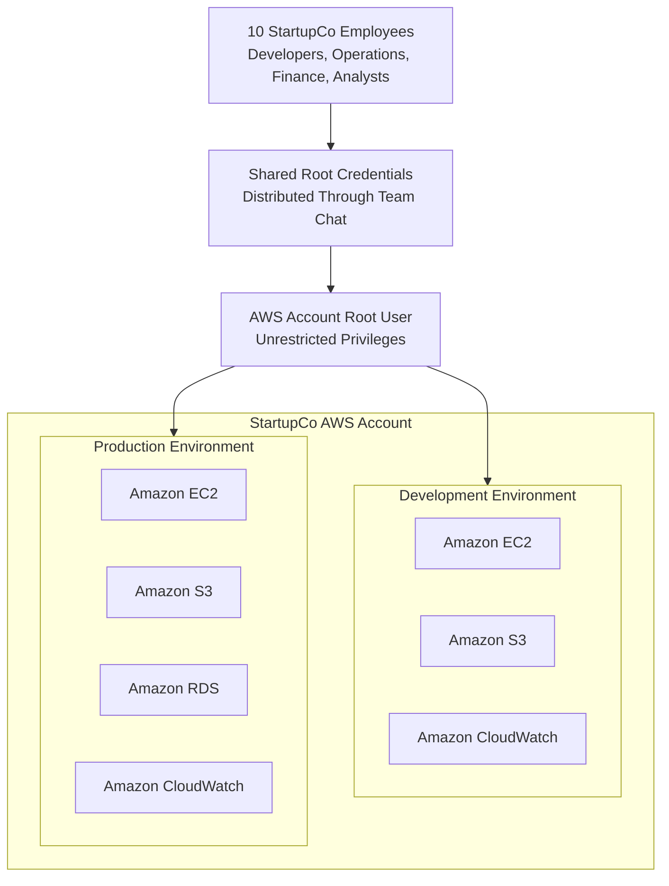

# StartupCo Current-State Architecture

## Architecture Question

How are StartupCo employees currently accessing and managing AWS resources?

## Current-State Characteristics

- All employees share one highly privileged identity.
- Credentials cannot be attributed to an individual employee.
- Every team receives unrestricted access.
- Development and production access are not separated.
- Individual access cannot be revoked.
- Root credentials are exposed through an inappropriate communication channel.
- No effective least-privilege model exists.
- A single compromised credential could expose the entire AWS environment.

## Primary Security Failure

StartupCo has no effective boundary between its workforce and the AWS account's most privileged identity. Authentication, authorization, accountability, and access revocation are all compromised by the shared-root model.