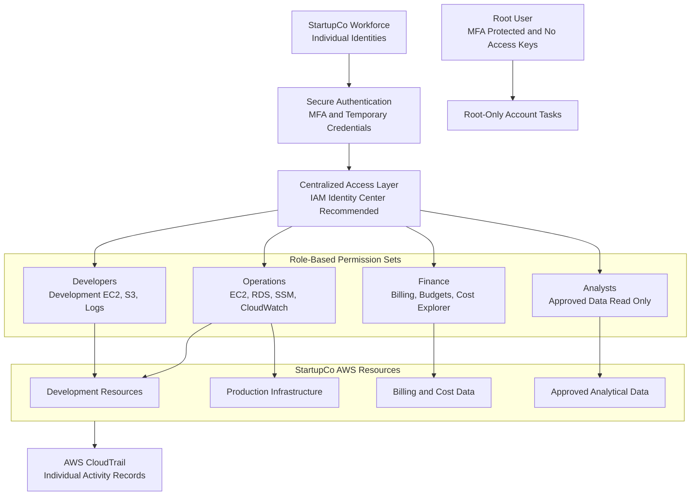

# StartupCo Target-State Architecture

## Architecture Question

How should StartupCo provide secure, role-based AWS access to its workforce?

## Target-State Characteristics

- Every employee uses an individually attributable identity.
- Authentication requires MFA.
- Workforce access uses temporary credentials where possible.
- Permissions are based on job responsibilities.
- Development and production access are separated.
- Finance cannot modify infrastructure.
- Analysts cannot modify data or administer databases.
- Root credentials are reserved for root-only account tasks.
- Root-user access keys do not exist.
- AWS activity can be attributed to an individual identity.

## Lab Implementation Note

This portfolio project uses IAM users and groups to demonstrate the academy's required access-control concepts. The fictional users will not receive permanent console passwords or access keys.

For a production workforce environment, StartupCo should use AWS IAM Identity Center or federation with an external identity provider. This would provide centralized identity management, role-based permission sets, and temporary AWS credentials.

## Security Outcome

The target design replaces shared, unrestricted access with individually attributable, least-privilege access aligned to each employee's business responsibilities.