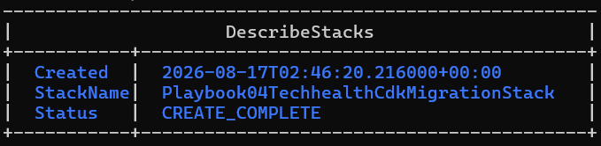
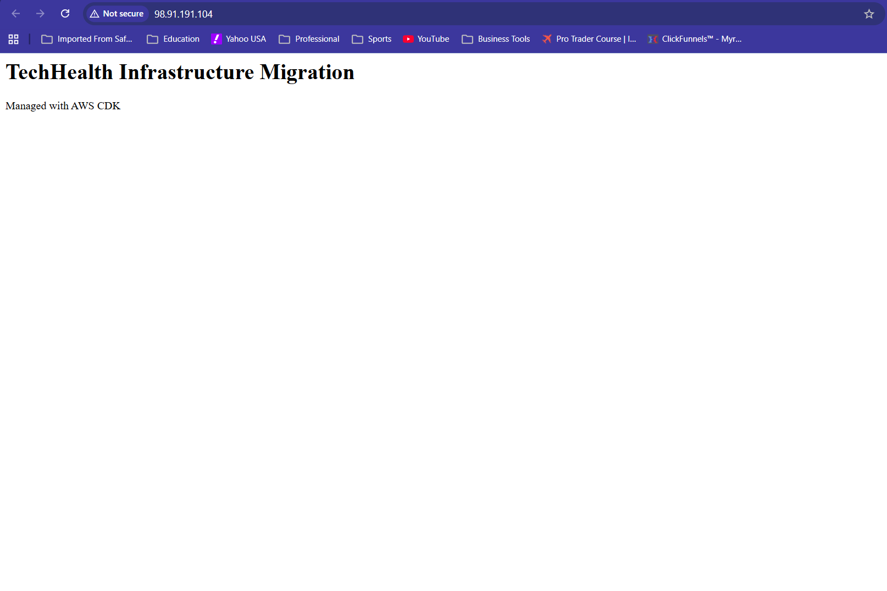
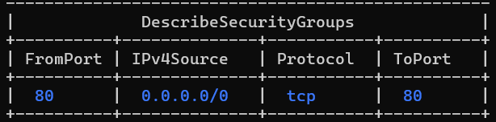
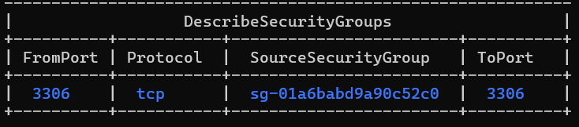
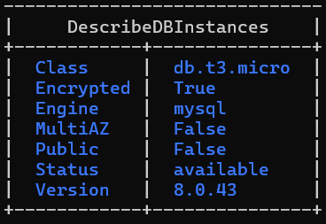
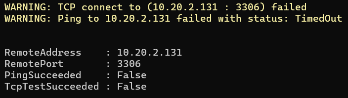
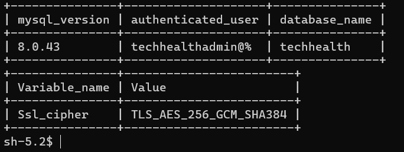
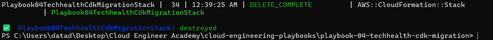
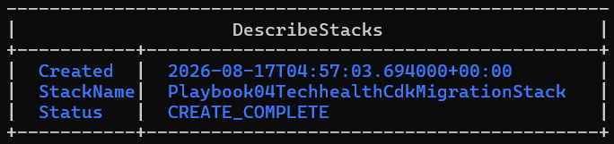
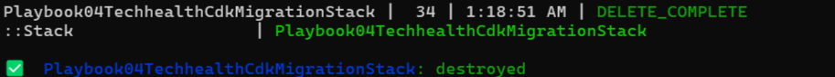

# TechHealth Infrastructure as Code Migration

A tested AWS CDK v2 reference implementation for migrating manually configured healthcare application infrastructure to a version-controlled, segmented, and reproducible AWS architecture.

## Project Summary

TechHealth Inc. is a fictional healthcare technology company whose AWS infrastructure had been managed manually through the AWS Console for approximately five years.

The legacy environment suffered from:

- No infrastructure version control
- Limited change traceability
- Outdated documentation
- Weak application and database segmentation
- Manually configured security groups
- No automated infrastructure testing
- Poor environment reproducibility

This project replaces that operating model with an AWS CDK application written in TypeScript and deployed through AWS CloudFormation.

No real patient information or protected health information was used.

## Architecture

### Current State

The current-state architecture documents the manually administered and poorly segmented legacy environment.

[View the current-state architecture](architecture/01-current-state.md)

### Target State

The target-state architecture documents the implemented CDK-managed VPC, application tier, database tier, IAM role, Secrets Manager integration, and network flows.

[View the target-state architecture](architecture/02-target-state.md)

## Implemented Infrastructure

- One VPC using `10.20.0.0/16`
- Two Availability Zones
- Two public `/24` subnets
- Two private isolated database `/24` subnets
- One internet gateway
- Zero NAT gateways
- One Amazon Linux 2023 EC2 `t3.micro` instance
- One RDS MySQL 8.0.43 `db.t3.micro` instance
- 20 GiB encrypted GP3 database storage
- One application security group
- One database security group
- One EC2 IAM role
- AWS Systems Manager Session Manager access
- AWS Secrets Manager-generated database credentials
- IMDSv2 enforcement
- Seventeen automated infrastructure tests

## Security Design

### Application Access

- Public TCP 80 was enabled only for the synthetic demonstration page.
- No inbound SSH rule was created.
- No EC2 key pair was required.
- Administrative access used Systems Manager Session Manager.
- IMDSv2 was required.

### Database Access

- RDS was placed in private isolated subnets.
- Public RDS accessibility was disabled.
- TCP 3306 was permitted only from the application security group.
- RDS storage encryption was enabled.
- The tested database session used TLS.
- Direct laptop-to-RDS connectivity was blocked.

### Credential Management

- The database password was generated by Secrets Manager.
- No credential was hard-coded or committed.
- The EC2 role could read only the database secret associated with the stack.
- Secret values were excluded from screenshots and documentation.

## Infrastructure Testing

The project contains 17 Jest and CDK assertion tests.

The tests verify:

- VPC and subnet counts
- Public and isolated subnet behavior
- Absence of NAT gateways
- Internet gateway creation
- EC2 instance class
- IMDSv2 enforcement
- Public HTTP access
- Absence of inbound SSH
- EC2 IAM trust
- Security-group-based MySQL access
- Private encrypted RDS configuration
- RDS subnet group creation
- Secrets Manager credential generation
- Resource-specific secret access
- Lab deletion behavior

Final result:

- Test suites: `1 passed`
- Tests: `17 passed`
- Failed tests: `0`

## Validation Results

| Test | Result |
|---|---|
| CDK synthesis | Passed |
| CDK change review | Passed |
| Initial deployment | Passed |
| EC2 status checks | Passed |
| HTTP application response | Passed |
| Session Manager access | Passed |
| Direct laptop-to-RDS connection | Blocked as intended |
| EC2-to-RDS connection | Passed |
| Secrets Manager retrieval | Passed |
| TLS database session | Passed |
| First stack destruction | Passed |
| Unchanged-code redeployment | Passed |
| Final stack destruction | Passed |

## Selected Evidence

### Initial Deployment

### Demonstration Application

The browser displays `Not secure` because the cost-controlled lab used HTTP only. A production patient portal would require HTTPS and should place application instances behind an Application Load Balancer.

### Application Ingress

### Database Ingress

### RDS Controls

### Direct Database Access Blocked

### Encrypted EC2-to-RDS Connectivity

### Reproducible Deployment Lifecycle

## Repository Structure

- `bin/` — CDK application entry point
- `lib/` — TechHealth infrastructure stack
- `test/` — Jest and CDK assertion tests
- `architecture/` — Current-state and target-state diagrams
- `images/` — Deployment and validation evidence
- `01-Business-Problem.md` — Client problem, scope, and success criteria
- `02-Architecture-Decisions.md` — Architecture decisions and tradeoffs
- `03-Implementation.md` — Build and deployment record
- `04-Validation.md` — Test results and evidence
- `05-Lessons-Learned.md` — Technical lessons and future improvements

## Documentation

1. [Business Problem](01-Business-Problem.md)
2. [Architecture Decisions](02-Architecture-Decisions.md)
3. [Implementation](03-Implementation.md)
4. [Validation](04-Validation.md)
5. [Lessons Learned](05-Lessons-Learned.md)
6. [Current-State Architecture](architecture/01-current-state.md)
7. [Target-State Architecture](architecture/02-target-state.md)

## Prerequisites

The project requires:

- An AWS account
- AWS CLI
- Configured AWS credentials
- Node.js and npm
- AWS CDK v2
- TypeScript
- Git
- Session Manager plugin for CLI-based EC2 sessions

Confirm AWS identity and Region before deployment.

The project was tested in `us-east-1`.

## Local Setup

Clone the parent repository and enter the project directory.

Install dependencies with `npm install`.

Do not install the legacy CDK v1 service packages referenced in the original Academy guide. This project uses the CDK v2 `aws-cdk-lib` package.

## Test the Infrastructure

Run:

`npm test`

Expected result:

`17 passed`

## Synthesize CloudFormation

Run:

`npx cdk synth`

This generates the CloudFormation template locally.

## Review Changes

Run:

`npx cdk diff`

Review:

- IAM changes
- Security-group rules
- Chargeable resources
- Resource replacements
- CloudFormation outputs

## Bootstrap the Environment

If the AWS account and Region have not been bootstrapped, run:

`npx cdk bootstrap aws://ACCOUNT_ID/REGION`

The shared `CDKToolkit` stack should be retained for future CDK projects unless there is a deliberate reason to remove it.

## Deploy

Run:

`npx cdk deploy`

Review the displayed IAM and security-group changes before approving deployment.

RDS creation may take several minutes.

## Validate

After deployment:

1. Confirm CloudFormation reaches `CREATE_COMPLETE`.
2. Open the application public IP.
3. Confirm HTTP status code `200`.
4. Verify EC2 instance and system status checks.
5. Confirm the instance is online in Systems Manager.
6. Start a Session Manager shell.
7. Retrieve the database secret without printing it.
8. Connect from EC2 to RDS.
9. Verify the selected database and active TLS cipher.
10. Confirm that direct laptop-to-RDS TCP 3306 access fails.
11. Inspect security-group and RDS configuration.

Never print, commit, or screenshot the secret value.

## Destroy

This stack contains chargeable resources.

After testing, run:

`npx cdk destroy`

Confirm that CloudFormation deletes the application stack.

The lab configures RDS for deletion and does not retain production-style backups.

## Cost Considerations

The project controls cost by using:

- EC2 `t3.micro`
- RDS `db.t3.micro`
- 20 GiB GP3 database storage
- Single-AZ RDS
- No NAT gateway
- No load balancer
- Prompt stack destruction

Potential charges include:

- EC2 instance usage
- Public IPv4 usage
- RDS instance usage
- RDS storage
- Secrets Manager usage
- Small bootstrap S3 storage usage

Free Tier eligibility should not be assumed.

## Production Limitations

This project is not a production healthcare platform.

A production implementation should evaluate:

- Application Load Balancer
- HTTPS with AWS Certificate Manager
- Private application subnets
- Auto Scaling
- Multi-AZ RDS
- Backup retention
- Point-in-time recovery
- Deletion protection
- Credential rotation
- VPC endpoints
- CloudWatch alarms and dashboards
- CloudTrail
- AWS Config
- GuardDuty
- Security Hub
- AWS WAF
- Centralized Session Manager logging
- Data migration and rollback procedures
- Formal compliance review

## Key Outcome

The project demonstrated how a manually managed AWS environment can begin transitioning toward a tested and reproducible Infrastructure as Code operating model.

The primary outcome was not simply the creation of AWS resources. It was the creation of a traceable engineering workflow:

`Test → Synthesize → Review → Deploy → Validate → Destroy → Recreate → Destroy`

That workflow directly addresses TechHealth's original problems with configuration drift, inconsistent environments, limited change history, and outdated infrastructure documentation.