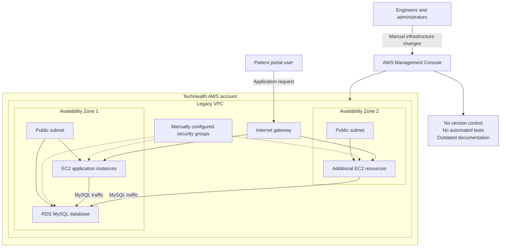

# TechHealth Current-State Architecture

TechHealth's legacy infrastructure was created manually through the AWS Management Console. Application and database resources share a poorly segmented network, while security-group rules and infrastructure changes are not managed through version-controlled code.

## Current-State Risks

- Infrastructure changes are performed manually and are not consistently attributable.
- Infrastructure cannot be recreated reliably across environments.
- Application and database tiers lack proper subnet segmentation.
- Security-group configuration is manual and vulnerable to configuration drift.
- Network behavior is not protected by automated infrastructure tests.
- Documentation may not reflect the resources currently deployed.
- Resources span Availability Zones without an intentional availability design.
- Database placement in a public subnet creates unnecessary exposure risk, even if security groups currently restrict access.