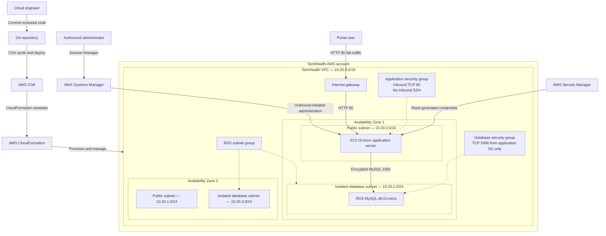

# TechHealth Target-State Architecture

The target state replaces manually configured infrastructure with a tested AWS CDK application written in TypeScript. AWS CloudFormation provisions a segmented VPC, controlled application access, an isolated database tier, generated credentials, and repeatable infrastructure lifecycle management.

## Implemented Security Boundaries

- EC2 is placed in a public subnet for the Academy lab requirement.
- No inbound SSH rule or EC2 key pair is required.
- Administrative access uses AWS Systems Manager Session Manager.
- RDS is placed in private isolated subnets with no internet route.
- RDS public accessibility is explicitly disabled.
- The database security group accepts MySQL only from the application security group.
- Database credentials are generated and stored in AWS Secrets Manager.
- The EC2 role can read only the database secret associated with this stack.
- RDS storage is encrypted.
- IMDSv2 is required on the EC2 instance.
- No NAT gateway is deployed.

## Availability and Production Boundaries

This is a cost-controlled portfolio environment, not a production healthcare platform.

- The VPC spans two Availability Zones.
- One public and one isolated database subnet exist in each Availability Zone.
- The RDS subnet group spans both isolated subnets.
- The deployed EC2 instance and RDS database are single-instance resources.
- `MultiAZ` is disabled for RDS to control lab costs.
- The application is therefore **multi-AZ-ready but not highly available**.
- HTTP is used only for synthetic demonstration traffic.
- A production patient portal should use HTTPS, an Application Load Balancer, private application instances, managed scaling, stronger monitoring, backup retention, deletion protection, and formal compliance controls.
- No real protected health information was stored or processed.